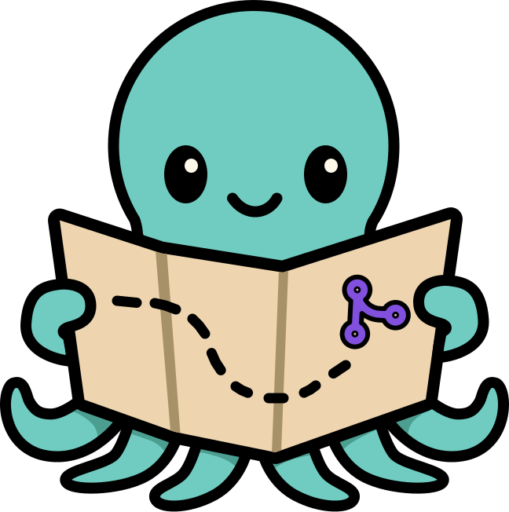

<h1 align="center">OctoGuide</h1>

	Helps contributors adhere to best practices for your repository on GitHub.
	🗺️

	<!-- prettier-ignore-start -->
	<!-- ALL-CONTRIBUTORS-BADGE:START - Do not remove or modify this section -->
	
<!-- ALL-CONTRIBUTORS-BADGE:END -->
	<!-- prettier-ignore-end -->
	
	
	
	
	

OctoGuide checks that contributor activity on your GitHub repository aligns with common expectations of smoothly-running projects.
It will automatically post friendly comments when contributors take actions you don't want them to.

👉 See **[octo.guide](https://octo.guide)** for documentation.

## Development

See [`.github/CONTRIBUTING.md`](./.github/CONTRIBUTING.md), then [`.github/DEVELOPMENT.md`](./.github/DEVELOPMENT.md).
Thanks! 🗺️

## Contributors

<!-- spellchecker: disable -->
<!-- ALL-CONTRIBUTORS-LIST:START - Do not remove or modify this section -->
<!-- prettier-ignore-start -->
<!-- markdownlint-disable -->
<table>
  <tbody>
    <tr>
      <td align="center" valign="top" width="14.28%"><a href="http://azat.io"> <b>Azat S.</b></a> <a href="https://github.com/JoshuaKGoldberg/OctoGuide/issues?q=author%3Aazat-io" title="Bug reports">🐛</a> <a href="https://github.com/JoshuaKGoldberg/OctoGuide/commits?author=azat-io" title="Code">💻</a> <a href="#ideas-azat-io" title="Ideas, Planning, & Feedback">🤔</a> <a href="https://github.com/JoshuaKGoldberg/OctoGuide/commits?author=azat-io" title="Documentation">📖</a></td>
      <td align="center" valign="top" width="14.28%"><a href="https://francoisbest.com/"> <b>François Best</b></a> <a href="https://github.com/JoshuaKGoldberg/OctoGuide/issues?q=author%3Afranky47" title="Bug reports">🐛</a> <a href="https://github.com/JoshuaKGoldberg/OctoGuide/commits?author=franky47" title="Code">💻</a></td>
      <td align="center" valign="top" width="14.28%"><a href="https://github.com/fabioatcorreia"> <b>Fábio Correia</b></a> <a href="https://github.com/JoshuaKGoldberg/OctoGuide/commits?author=fabioatcorreia" title="Documentation">📖</a></td>
      <td align="center" valign="top" width="14.28%"><a href="http://www.joshuakgoldberg.com"> <b>Josh Goldberg ✨</b></a> <a href="https://github.com/JoshuaKGoldberg/OctoGuide/issues?q=author%3AJoshuaKGoldberg" title="Bug reports">🐛</a> <a href="https://github.com/JoshuaKGoldberg/OctoGuide/commits?author=JoshuaKGoldberg" title="Code">💻</a> <a href="#content-JoshuaKGoldberg" title="Content">🖋</a> <a href="https://github.com/JoshuaKGoldberg/OctoGuide/commits?author=JoshuaKGoldberg" title="Documentation">📖</a> <a href="#ideas-JoshuaKGoldberg" title="Ideas, Planning, & Feedback">🤔</a> <a href="#infra-JoshuaKGoldberg" title="Infrastructure (Hosting, Build-Tools, etc)">🚇</a> <a href="#maintenance-JoshuaKGoldberg" title="Maintenance">🚧</a> <a href="#projectManagement-JoshuaKGoldberg" title="Project Management">📆</a> <a href="#tool-JoshuaKGoldberg" title="Tools">🔧</a> <a href="https://github.com/JoshuaKGoldberg/OctoGuide/commits?author=JoshuaKGoldberg" title="Tests">⚠️</a> <a href="#design-JoshuaKGoldberg" title="Design">🎨</a></td>
      <td align="center" valign="top" width="14.28%"><a href="https://phryneas.de"> <b>Lenz Weber-Tronic</b></a> <a href="#ideas-phryneas" title="Ideas, Planning, & Feedback">🤔</a></td>
    </tr>
  </tbody>
</table>

<!-- markdownlint-restore -->
<!-- prettier-ignore-end -->

<!-- ALL-CONTRIBUTORS-LIST:END -->
<!-- spellchecker: enable -->

> 💝 This package was templated with [`create-typescript-app`](https://github.com/JoshuaKGoldberg/create-typescript-app) using the [Bingo framework](https://create.bingo).
